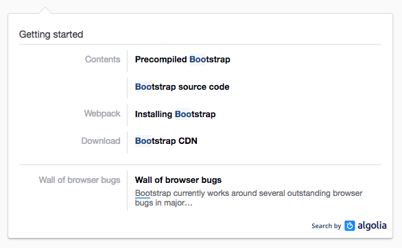

DocSearch default colorscheme comes in grey colors with blue highlight. 



This theme works well with most websites, but we encourage you to style it to
your own colors. This can be achieved by overriding the CSS classes used by the
default theme. 

The following annotated example will help you style each part:

```css
/* Match title (eg. Bootstrap CDN) */
.algolia-docsearch-suggestion--title {
  font-weight: bold;
  color: black;
}

/* Match description (eg. Bootstrap currently works...) */
.algolia-docsearch-suggestion--text {
  font-size: .8rem;
  color: gray;
}

/* Match category (eg. Downloads) */
.algolia-docsearch-suggestion--subcategory-column {
  color: gray;
}

/* Match main category (eg. Getting Started) */
.algolia-docsearch-suggestion--category-header {
  color: darkgray;
  border: 1px solid gray;
}

/* Highlighted text */
.algolia-docsearch-suggestion--highlight {
  color: blue;
}
```

## Debugging

If you want to inspect the dropdown markup with your browser tools, you should
add `debug: true` to your `docsearch` call to prevent it from closing on
inspection.

```javascript
docsearch({ 
  […],
  debug: true
});
```

## Other considerations

Currently selected suggestion are wrapped in a `.ds-cursor` class. This means
that you can use `.ds-cursor .algolia-docsearch-suggestion--content` to style
the currently selected suggestion for example.

On small screens, DocSearch reverts to a single column layout, while the
two-column layout shown in the screenshot is only used on larger screens. You
can media queries (for example `@media (min-width: 768px) {}`) to target one or
the other display.

We ask you not to try to hide the _search by Algolia_ logo through CSS, as its
display is mandatory if you're using the free hosted version of DocSearch.


## Advanced styling

If you want to more heavily style the results, feel free to have a look at the
[SCSS source code](https://github.com/algolia/docsearch/tree/master/src/styles).
`_variables.scss` contains all the default colors, sizing and breakpoints.

You can generate your own CSS file by cloning the repo and running `yarn run
build:css`. The resulting file will be generated in `./dist/cdn`, and should be
used instead of the default one.
